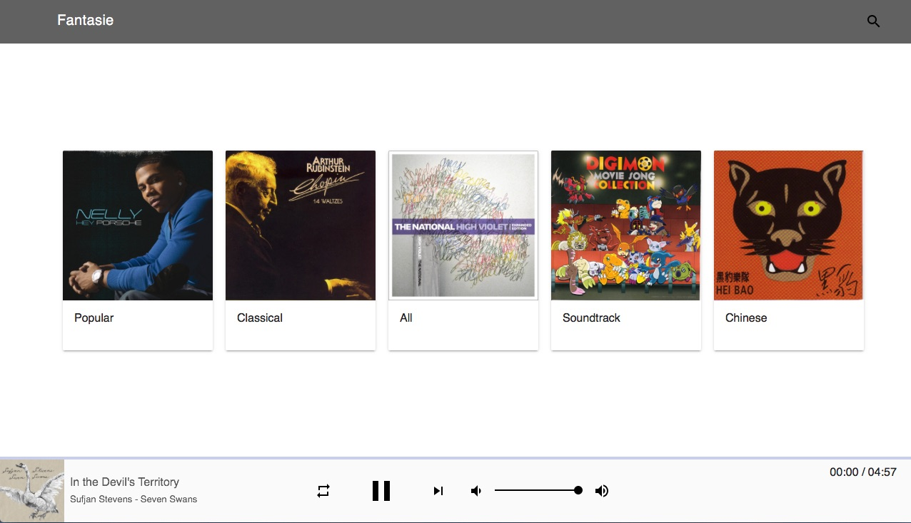

# fantasie

Fantasie是一个基于iTunes本地音乐库的HTML5音乐电台应用

Fantasie是幻想曲的德文翻译，fantasia是意大利文翻译，英文直接采用是意大利文单词

Fantasie支持AAC和ALAC两种音频格式，推荐使用Safari浏览器体验原生ALAC无损音乐，如使用的是非Safari浏览器，可在后台设置是否对ALAC进行转码

当前fantasie的主要使用场景一般考虑为局域网环境。它弥补了iTunes家庭共享在局域网跨网段环境下的不足，无需iTunes客户端，就能轻松的实现音乐电台式随机播放

编写它的初衷就是希望能在校园局域网内可以随时随地的听我自己的iTunes曲库

## 前后端说明

本项目采用除了一些B/S基础特性（如HTTP Header, Cookie）之外前后端分离的模式

+ [前端说明](frontend/README.md)
+ [后端说明](backend/README.md)

## 截图

## 协议

本项目基于MIT协议开源，协议内容参见[LICENSE](LICENSE)
